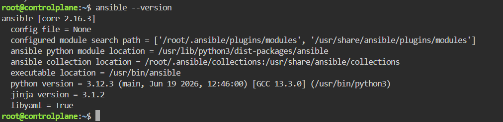
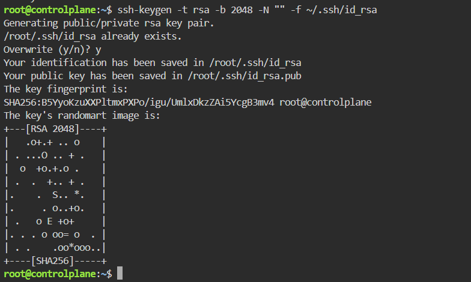
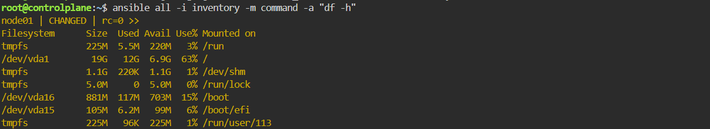

# Initial Ansible Configuration and Ad-Hoc Execution

This lab covers the essential baseline for setting up Ansible configuration management. It demonstrates verifying Ansible installation on the control node, establishing SSH key-based access, creating an inventory file, and executing an Ansible ad-hoc command to inspect disk space on a target managed node.

---

## Step 1: Verify Ansible Installation
Verify that Ansible and its Python dependencies are properly installed on the control plane node:

```bash
ansible --version
```



## Step 2: Generate SSH Key Pair
Generate a 2048-bit RSA key pair on the control plane to enable passwordless authentication:




## Step 4: Create the Inventory File
Define the inventory file containing the target host configuration (node01) using a local connection parameter:

```Bash
echo -e "[managed]\nnode01 ansible_connection=local" > inventory
```

## Step 5: Execute Ad-Hoc Command
Run an Ansible Ad-Hoc command using the command module to check disk space availability across all managed nodes defined in the inventory:


