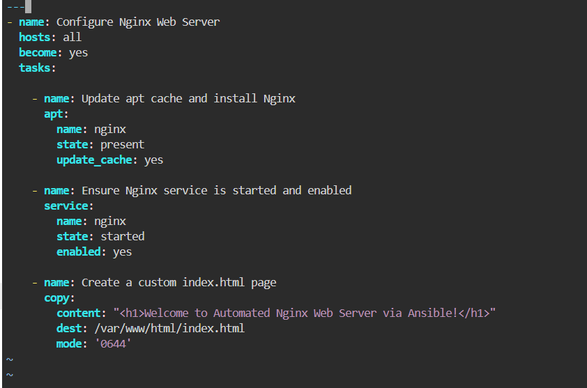
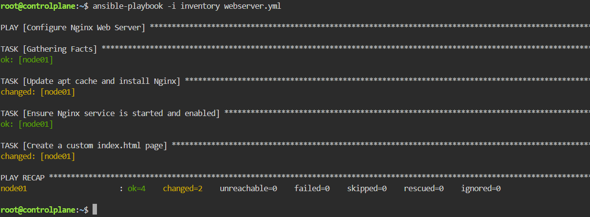

# Automated Web Server Configuration Using Ansible Playbooks
This lab demonstrates automating web infrastructure deployment using Ansible Playbooks. It covers writing a structured YAML playbook to automate package management, service orchestration, and custom file deployment for an Nginx web server, followed by verifying the web server response via Ansible ad-hoc execution.

---

## Step 1: Create the Ansible Playbook
Create a new file named `webserver.yml` with the following configuration:

## Step 2: Execute the Playbook
Run the playbook against the inventory using ansible-playbook:

## Step 3: Verify Web Server Configuration
Verify that Nginx is active and serving the customized landing page by executing an HTTP GET request through an Ansible Ad-Hoc command:

