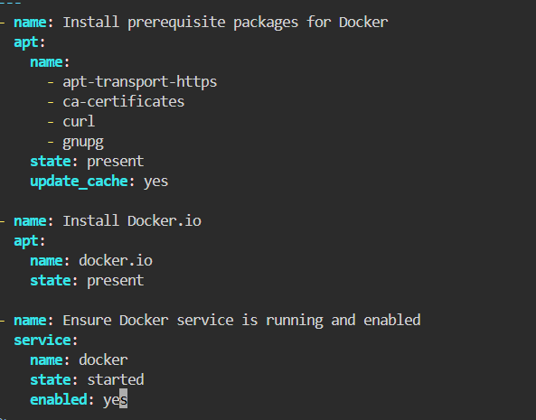
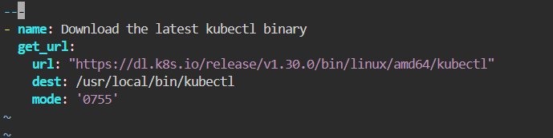
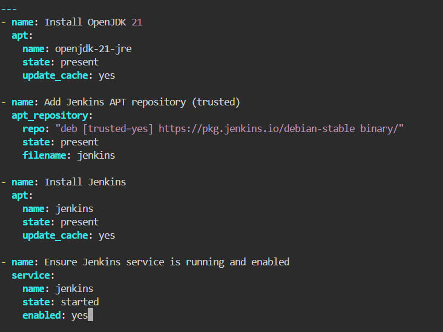
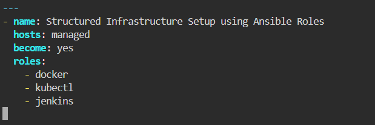
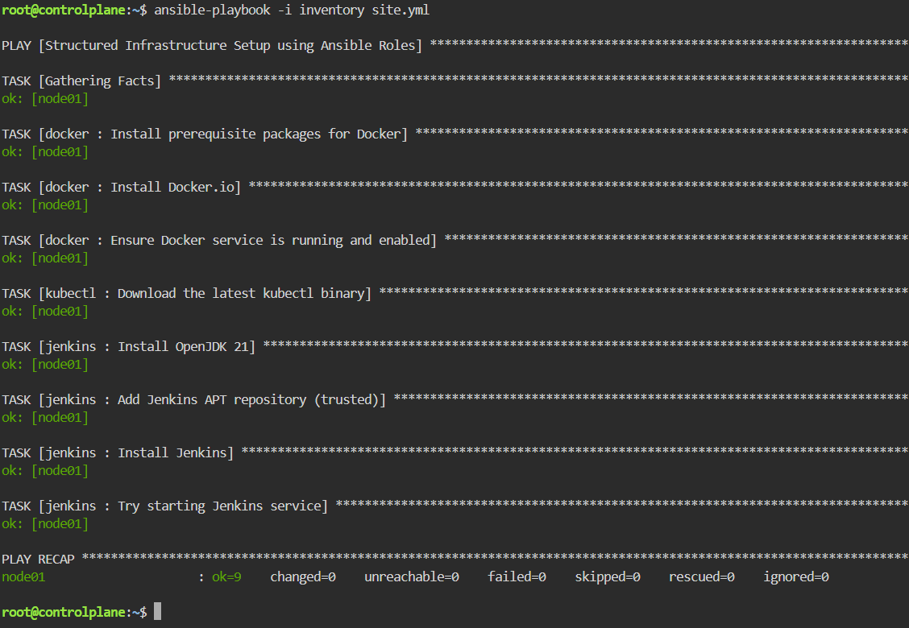
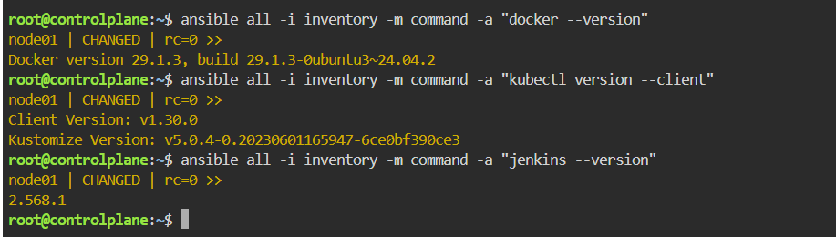

# Structured Configuration Management with Ansible Roles

This lab covers modularizing configuration management by utilizing Ansible Roles. Instead of writing a single monolithic playbook, infrastructure provisioning is decoupled into independent roles (docker, kubectl, and jenkins). Each role manages the deployment lifecycle of its target DevOps component, ensuring code reusability, maintainability, and clean orchestration via a central site.yml playbook.

---

## Step 1: Define the Docker Role (roles/docker/tasks/main.yml)
Create the tasks file for provisioning Docker Engine:

## Step 2: Define the kubectl Role (roles/kubectl/tasks/main.yml)
Create the tasks file for installing the Kubernetes CLI tool:

## Step 3: Define the Jenkins Role (roles/jenkins/tasks/main.yml)
Create the tasks file for installing OpenJDK runtime and setting up Jenkins:

## Step 4: Create Main Orchestration Playbook (site.yml)
Define the main playbook to call and run all configured roles sequentially:

## Step 5: Execute the Main Playbook
Run site.yml against the managed host inventory:

## Step 6: Verify Installed Tool Versions
Execute Ansible Ad-Hoc commands to confirm installation and extract version details across managed nodes:

>Note on Inventory Scope: Since node01 is currently the sole host defined under the [managed] group, both targets (all and managed) yield identical execution results.

