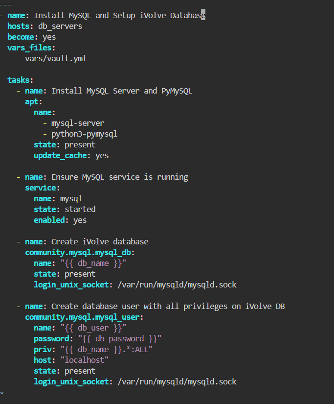
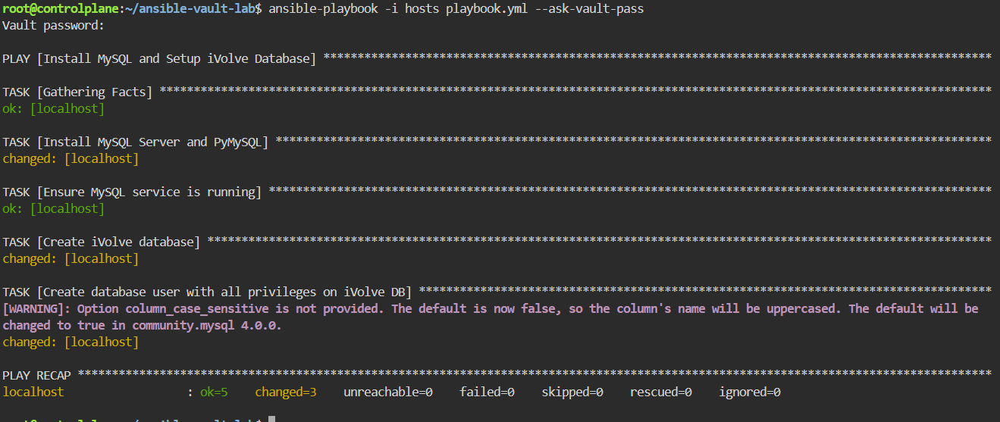
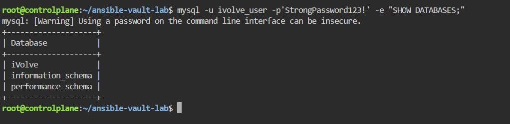

# Securing Sensitive Data with Ansible Vault

Automating the installation of MySQL, creating a database and user with full privileges, and encrypting sensitive parameters using **Ansible Vault**.

---

## Step 1: Encrypt Sensitive Data with Ansible Vault
Create an encrypted variables file using ansible-vault:

```Bash

mkdir vars
ansible-vault create vars/vault.yml
```
Set a vault password when prompted, then add the following variables:

``` bash
db_name: "iVolve"
db_user: "ivolve_user"
db_password: "StrongPassword123!"
```
## Step 3: Write the Ansible Playbook
Create playbook.yml to automate the MySQL installation, database creation, and user granting:




## Step 4: Run the Playbook
Execute the playbook and pass the --ask-vault-pass flag to decrypt the vault file during execution:



## Step 5:Validation & Verification
Verify the database setup on the managed node by logging in with the newly created user and listing the databases:



>Security Note:
- Passing the password inline (-p'Password') stores it in shell history, which is insecure instead Prompt for the password interactively so it remains hidden
-  Alternative Best Practice (Option File) :Store credentials securely in ~/.my.cnf (chmod 600) so you can execute commands directly without inline passwords or warnings:


