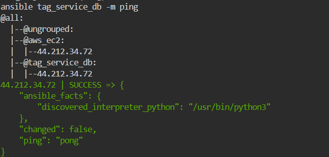

#  Automated Host Discovery with Ansible Dynamic Inventory
An end-to-end automation lab demonstrating Dynamic Host Discovery on AWS EC2 using Ansible's amazon.aws.aws_ec2 inventory plugin, paired with automated database provisioning via Galaxy roles (geerlingguy.mysql).

---

## Step 1: AWS EC2 Provisioning
Create key pair credentials and launch the target instance configured with the key tag service=db:

```Bash
# Generate Key Pair & Set File Permissions
aws ec2 create-key-pair \
    --key-name fresh-ansible-key \
    --query 'KeyMaterial' \
    --output text > /root/.ssh/ansible-lab-key.pem

chmod 400 /root/.ssh/ansible-lab-key.pem

# Provision EC2 Instance with Specific Tagging
aws ec2 run-instances \
    --image-id ami-0c7217cdde317cfec \
    --instance-type t2.micro \
    --key-name fresh-ansible-key \
    --tag-specifications 'ResourceType=instance,Tags=[{Key=service,Value=db},{Key=Name,
```

## Step 2: Inventory & Ansible Configuration
Define ansible.cfg to enable the EC2 plugin, and write aws_ec2.yaml for filtered discovery:

- ansible.cfg
```bash
[defaults]
inventory = aws_ec2.yaml
host_key_checking = False
remote_user = ubuntu
private_key_file = /root/.ssh/ansible-lab-key.pem

[inventory]
enable_plugins = amazon.aws.aws_ec2
```
- aws_ec2.yaml

```bash
plugin: amazon.aws.aws_ec2
regions:
  - us-east-1

filters:
  instance-state-name: running
  tag:service: db

keyed_groups:
  - key: tags.service
    prefix: tag_service

hostnames:
  - ip-address
  - dns-name

compose:
  ansible_host: public_ip_address
```
## Step 3: Execution Verification & Proof of Work
1. Dynamic Host Discovery (ping)
Inspect inventory structure graph and verify node reachability:
```bash
ansible-inventory -i aws_ec2.yaml --graph
ansible tag_service_db -m ping
```


Download geerlingguy.mysql role and run the setup playbook:
