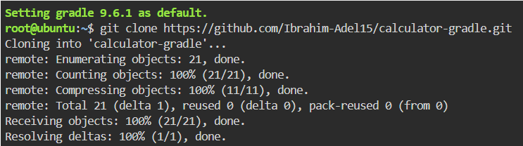
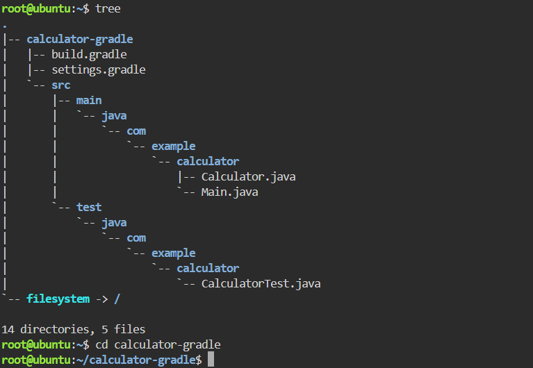
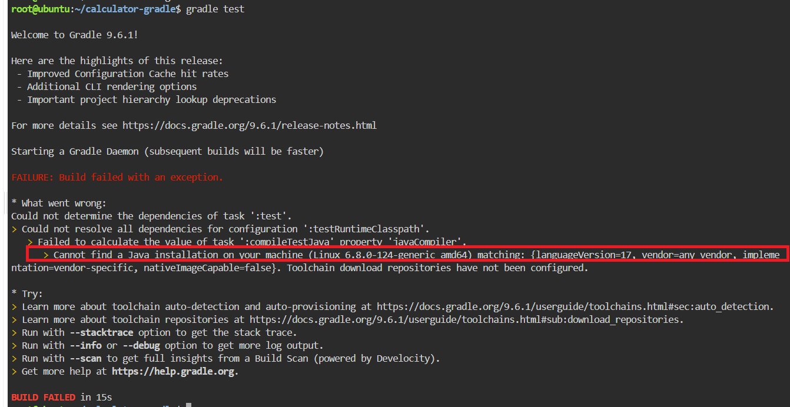
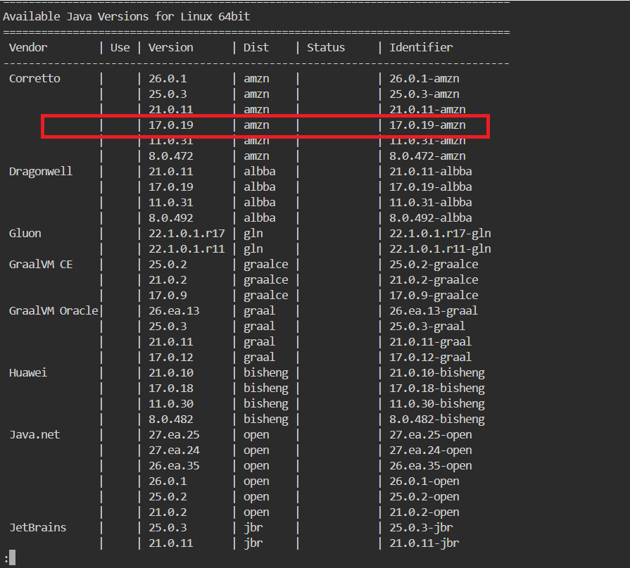
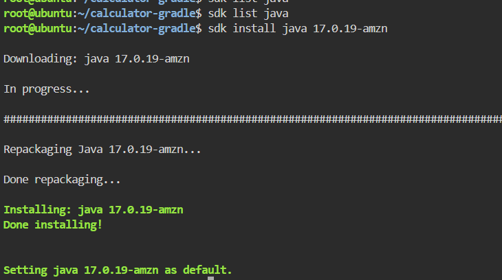
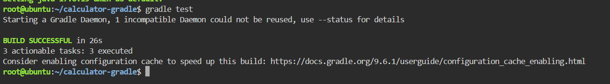
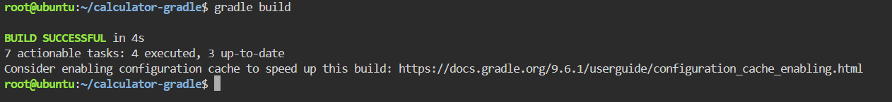
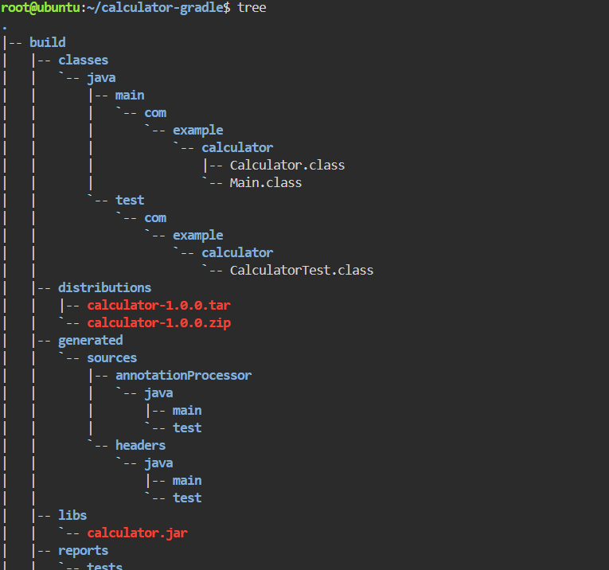
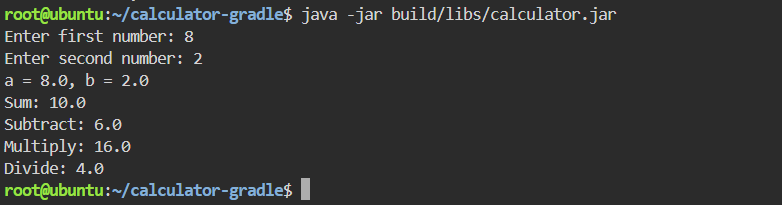

# Building and Packaging a Java Application with Gradle

This repository documents the step-by-step process of setting up, testing, building, and running a Java-based calculator application using **Gradle**. It also highlights a common Java Toolchain issue encountered during execution and how it was successfully resolved.

##  Step 1: Cloning the Repository


Clone the source code from GitHub:
```bash
git clone https://github.com/Ibrahim-Adel15/calculator-gradle.git
cd calculator-gradle
```




##  Step 2: Run the Unit Test

When attempting to execute the unit test using gradle test, the build failed with the following error:



As shown above, Gradle’s toolchain detected that the project strictly requires Java 17, which was missing from the local environment.
### Resolution Steps
    1- List Available Java Versions
    2- Install & Set Java 17 as Default
  
  

### Run the Unit Test again 
With Java 17 successfully configured, running gradle test compiled the test classes and completed flawlessly.



## Step 3: Build the Application Artifact
Package the project into a JAR file using Gradle:





## Step 4: Run the Application
Run the packaged Java application using: 
```bash
java -jar build/libs/calculator.jar
```


## Summary
- Clone the source code from GitHub
- Run the Unit Test
- Build the Application Artifact
- Run the Application
