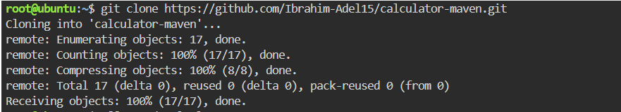
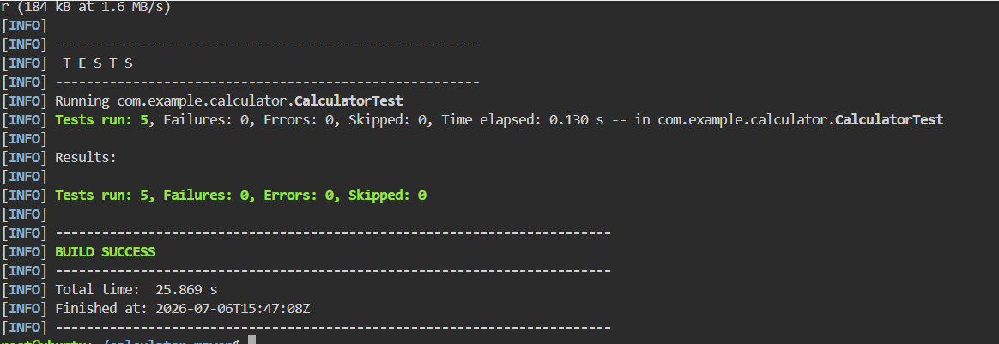
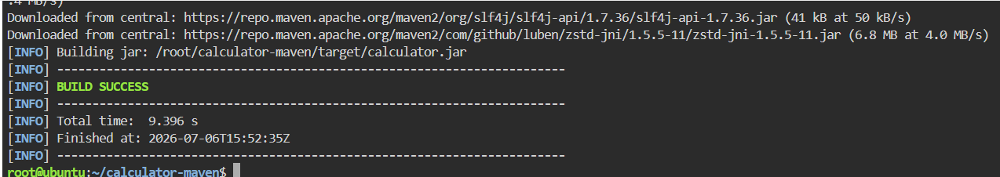
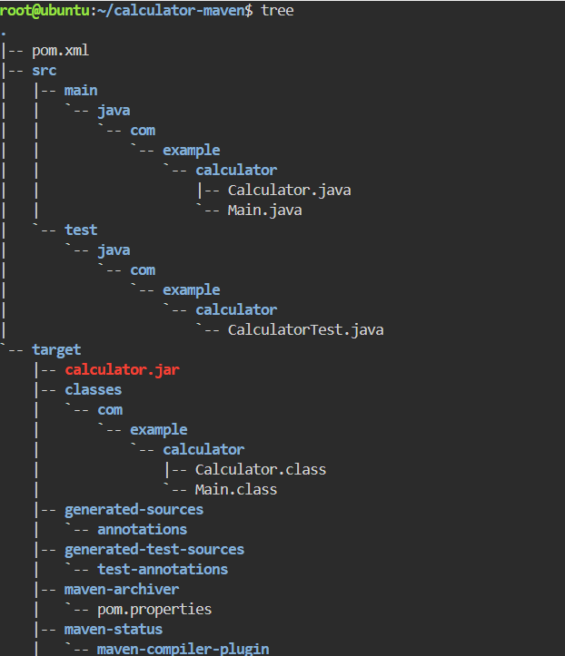
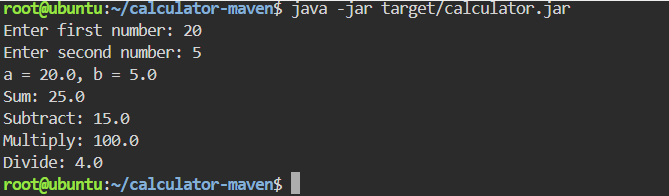

# Building and Packaging a Java Application with maven

This repository documents the step-by-step process of setting up, testing, building, and running a Java-based calculator application using **maven**.

##  Step 1: Cloning the Repository


Clone the source code from GitHub:
```bash
git clone https://github.com/Ibrahim-Adel15/calculator-maven.git
cd calculator-maven
```


##  Step 2: Run the Unit Test
Excute the unit tests for the project using:
```bash
mvn test
```


## Step 3: Build the Application Artifact
Package the project into a JAR file using maven:
```bash
mvn package
```




## Step 4: Run the Application
Run the packaged Java application using: 
```bash
java -jar target/calculator.jar
```


## Summary
- Clone the source code from GitHub
- Run the Unit Test
- Build the Application Artifact
- Run the Application

