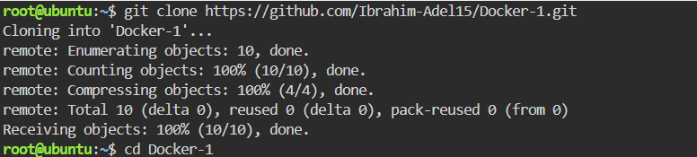
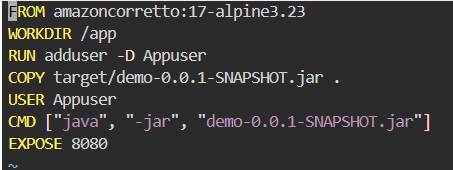
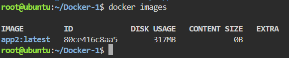
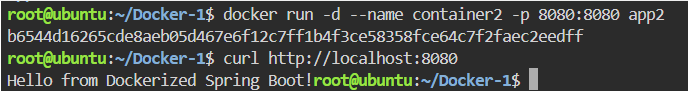

# Dockerized Spring Boot Application

This repository demonstrates the containerization of a Spring Boot application using Docker. It covers building a custom Docker image, managing multi-architecture scenarios, configuring container port mapping, and testing the application lifecycle in isolated environments.

---

##  Step 1: Cloning the Repository


Clone the source code from GitHub:
```bash
git clone https://github.com/Ibrahim-Adel15/Docker-1.git
cd Docker-1
```


##  Step 2: Build the application
Package the project into a JAR file using maven


## Step 3: Write the Dockerfile
Create a file named Dockerfile and add the following content:




## Step 4: Build the app2 Image
Execute the build command and to check the image size run:
```bash
docker build -t app2 .
docker images
```


## step 5: Run container2 from app2 Image & Test the Application
Run the container in detached mode (-d) and map the host's port 8080 to the container's internal port 8080:
```bash
docker run -d --name container2 -p 8080:8080 app2
curl http://localhost:8080
```



