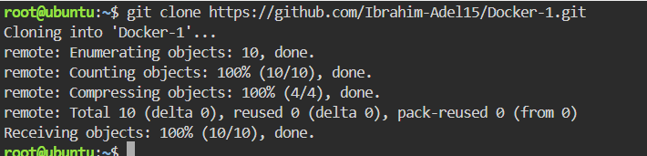
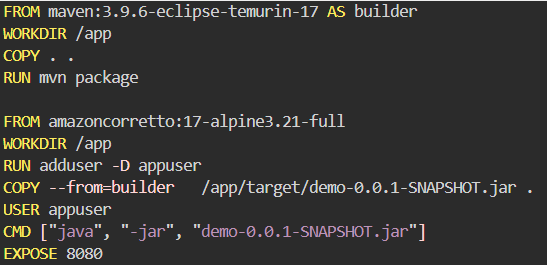
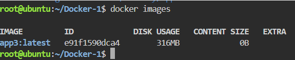
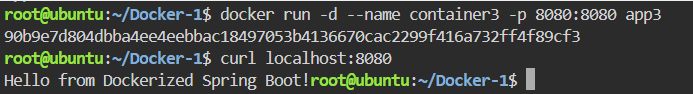

# Multi-Stage Build for a Java App

This repository demonstrates the secure and optimized containerization of a Spring Boot application using a Docker Multi-Stage Build. It covers building a minimal and production-ready custom Docker image, configuring non-root user security practices, managing port mapping, and testing the application lifecycle in isolated environments.

---

##  Step 1: Cloning the Repository


Clone the source code from GitHub:
```bash
git clone https://github.com/Ibrahim-Adel15/Docker-1.git
cd Docker-1
```


##  Step 2: Write the Dockerfile
Create a file named `Dockerfile` using a multi-stage approach to separate the build environment (Maven) from the runtime environment (Alpine JRE) to optimize the image size.




## Step 3: Build the app3 Image
Execute the build command and to check the image size run:
```bash
docker build -t app3 .
docker images
```


## step 4: Run container2 from app2 Image & Test the Application
Run the container in detached mode (-d) and map the host's port 8080 to the container's internal port 8080:
```bash
docker run -d --name container3 -p 8080:8080 app3
curl localhost:8080
```



