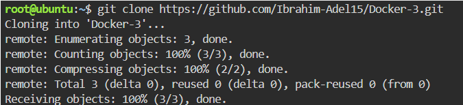
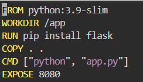
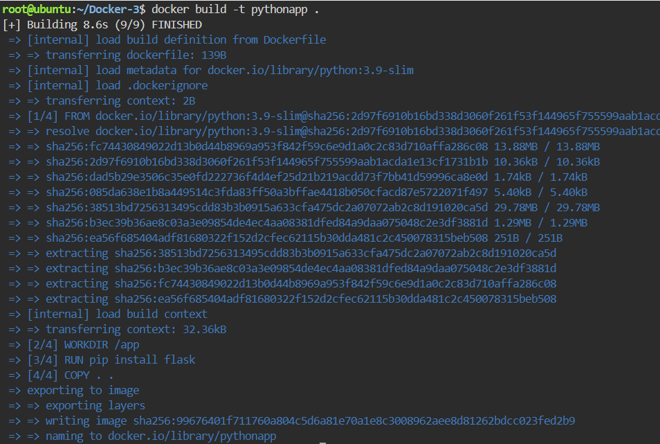
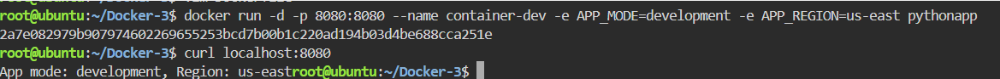
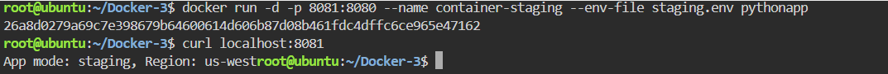
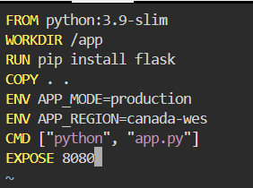
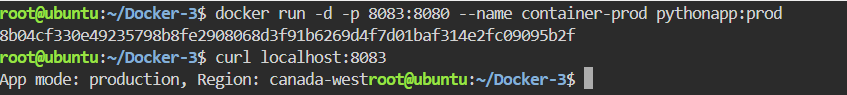

# Managing Docker Environment Variables Across Build and Runtime
This repository demonstrates how to manage environment variables efficiently across both build time and runtime using Docker. It covers fetching code, using python-slim base image, configuring Flask, and applying three different approaches to inject environment variables (via runtime flags, environment files, and inline Dockerfile configuration).

---
## Step 1: Cloning the Repository

Clone the application source code from GitHub and navigate into the project directory:
```bash
git clone https://github.com/Ibrahim-Adel15/Docker-3.git
cd Docker-3
```


## Step 2: Write the Dockerfile (Initial Setup)
Create a file named `Dockerfile` to configure the Python Flask application. In this initial setup, we will keep it clean from environment variables to test runtime injection first.



## Step 3: Build the Docker Image
Build the base Docker image and name it pythonapp:
```bash
docker build -t pythonapp .
```


## Step 4: [Approach 1] Inject Variables via Runtime Command (-e flag)
Run the first container (container-dev) for the development environment by passing the variables directly in the command line using the -e flag, then test the response:
```bash
docker run -d -p 8080:8080 --name container-dev -e APP_MODE=development -e APP_REGION=us-east pythonapp
curl localhost:8080
```



## Step 5: [Approach 2] Inject Variables via Environment File (.env file)
Create an environment file named staging.env containing the configuration for the staging environment:
```bash
APP_MODE=staging
APP_REGION=us-west
```
Run the second container (container-staging) by passing the filename using the --env-file flag, then test the response:
```bash
docker run -d -p 8081:8080 --name container-staging --env-file staging.env pythonapp
curl localhost:8081
```


## Step 6: [Approach 3] Embed Variables inside the Container (Dockerfile ENV)
Modify the `Dockerfile` to include the production environment variables as built-in defaults using the ENV instruction:



Rebuild the image with a new tag (prod):
```bash
docker build -t pythonapp:prod .
```


Run the third container (container-prod) without passing any external variables, as it will automatically read them from within the container, then test the response:
```bash
docker run -d -p 8083:8080 --name container-prod pythonapp:prod
curl localhost:8083
```


---

## 🏆 Conclusion & Best Practices Summary 
 For a scalable and collaborative project, the best practice is to combine Approach 2 (Environment Files) and Approach 3 (Dockerfile Defaults):

- Documented Defaults (Dockerfile ENV): Using the ENV instruction inside the Dockerfile serves as living documentation. It defines the baseline variables needed for the app to run. Any new developer joining the project can immediately understand what configuration the application expects just by reading the Dockerfile.

- Environment Files (.env or .env-file):
Instead of modifying the Dockerfile or running huge CLI commands every time a variable changes, variables should be centralized into a structured file (e.g., staging.env, prod.env).

## 💎 Key Benefits of this Workflow:
- Time-Saving: Team members can switch between environments (Dev, Staging, Prod) instantly by just swapping the file name in the command, without rebuilding images or modifying code.

- Perfect Documentation: The .env files (or a .env.example template) act as a single source of truth, ensuring that everyone on the team is aligned on the required configurations.

- Security & Cleanliness: Keeps sensitive credentials out of the core image layer while keeping the deployment workflow fast and automated.

