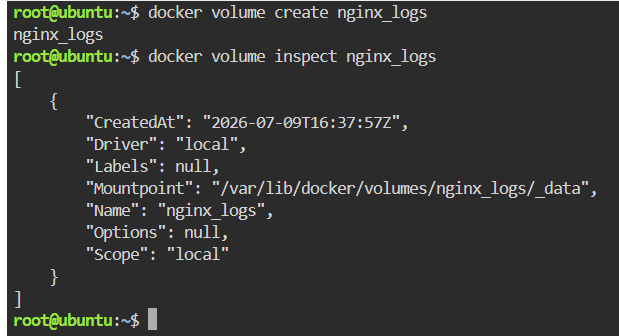
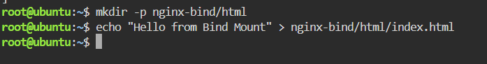
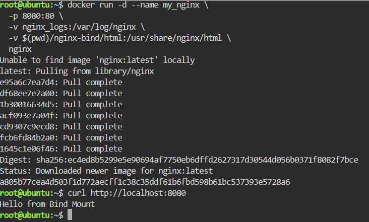
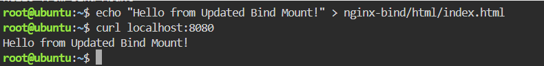
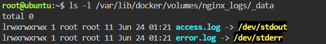

# Docker Volume and Bind Mount with Nginx

This repository demonstrates a practical, hands-on approach to mastering storage options in Docker. It explores the key differences between **Docker Named Volumes** (managed by Docker for data persistence like logs) and **Bind Mounts** (linking a specific host directory to a container for instant source code updates).

---

## Step 1: Create a Docker Named Volume for Persistent Logs

Create a dedicated Docker volume named `nginx_logs` to ensure that Nginx access and error logs persist on the host machine even if the container is destroyed.

```bash
docker volume create nginx_logs
```
Verify the creation and inspect the volume's default storage path (Mountpoint) on your host machine:
```bash
docker volume inspect nginx_logs
```


## Step 2: Set Up the Bind Mount and Custom File
Next, you will prepare the local directory and file on your host machine that you want the Nginx server to host.

Create the directory structure nginx-bind/html all at once using the -p flag:
```bash
mkdir -p nginx-bind/html
```
Create an index.html file inside that directory containing the phrase "Hello from Bind Mount":



## Step 3: Run the Nginx Container with Volume and Bind Mount
Now, start the container and map both the Named Volume and the Bind Mount simultaneously within a single command:



## Step 4: Verify Nginx and the Bind Mount
Verify that the Nginx server is correctly serving your custom file by sending a request to port 8080 using curl:


## Step 5: Modify the HTML File and Confirm Real-Time Updates
A key advantage of a Bind Mount is that any changes made to the host file system are instantly reflected inside the container without requiring a container restart.

Update the text in your local index.html file:
Test it again using curl:



## Step 6: Verify Log Storage in the Volume
Since you executed the curl command twice, Nginx should have recorded these access logs. Let's verify that they are safely stored in the volume on the host.




