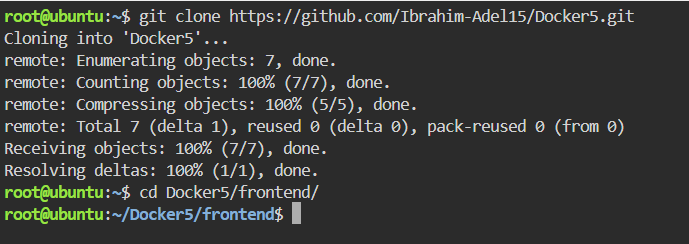
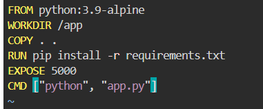
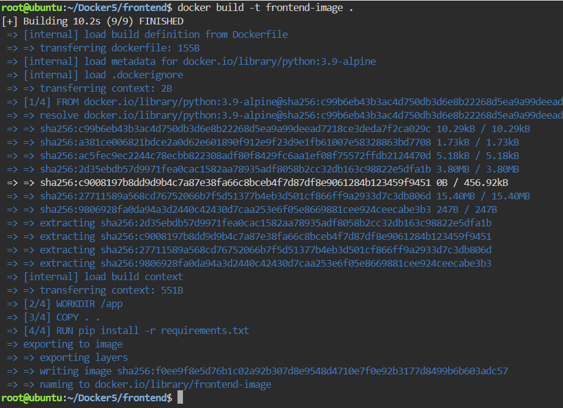
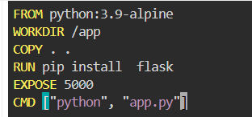
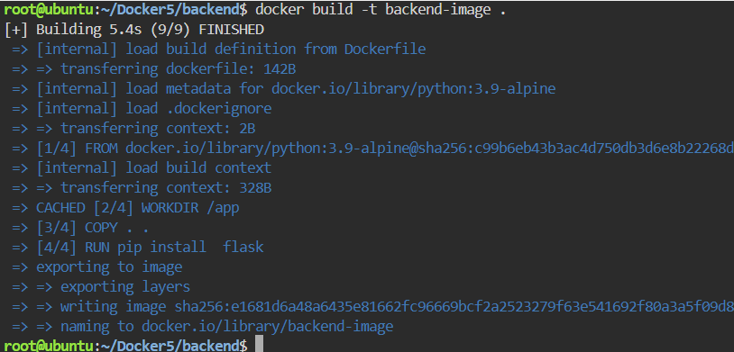
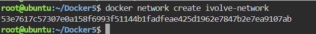
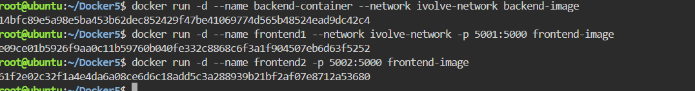
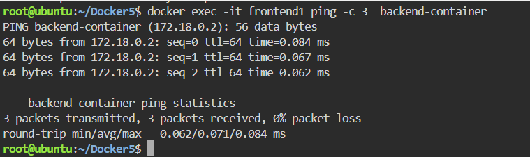
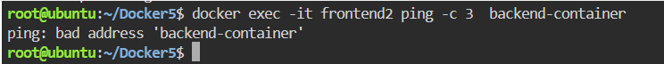

# Custom Docker Network for Microservices
A step-by-step practical laboratory guide demonstrating containerization and secure service discovery using Docker custom networks. This lab sets up isolated Frontend and Backend multi-container environments to demonstrate the principles of **Docker Network Isolation**.
---

## Step 1: Clone the Repository
Open your terminal and run the following commands to download the project files

```bash
git clone https://github.com/Ibrahim-Adel15/Docker5.git
cd Docker5
```


## Step 2: Containerize the Frontend Service
Navigate to the frontend directory and create a file named Dockerfile:



Build the Frontend Image:
Execute the following build command to compile your source files into a reusable Docker image tagged as frontend-image:




## Step 3: Containerize the Backend Service
Switch over to the backend directory and create a new Dockerfile:



Build the Backend Image:
Compile the backend application into a Docker image tagged as backend-image:



## Step 4: Provision a Custom Network
Docker's default bridge network does not support automatic service discovery by container name. To enable cross-container communication via DNS, provision a custom user-defined bridge network named ivolve-network:



## Step 5: Instantiate Containers on Different Networks
- Spin up the Backend container on ivolve-network:
- Spin up the First Frontend container (frontend1) on the same custom network:
- Spin up the Second Frontend container (frontend2) on the Default Bridge Network:
   


## Step 6: Verify Network Isolation & Communication
Containers running on the same custom network (ivolve-network) can find each other automatically using Docker’s embedded DNS server. Containers located outside this network perimeter remain completely isolated.




## Conclusion
- frontend1 ➡️ backend-container (Success ✅): Since both are on the same custom network, network traffic passes through smoothly, and DNS resolves the container name perfectly.

- frontend2 ➡️ backend-container (Failure ❌): Because frontend2 resides on the default network, it is completely isolated. It cannot resolve the backend's name or establish a connection, proving that custom networks successfully isolate and secure your microservices.
