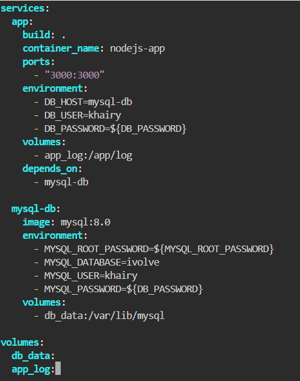
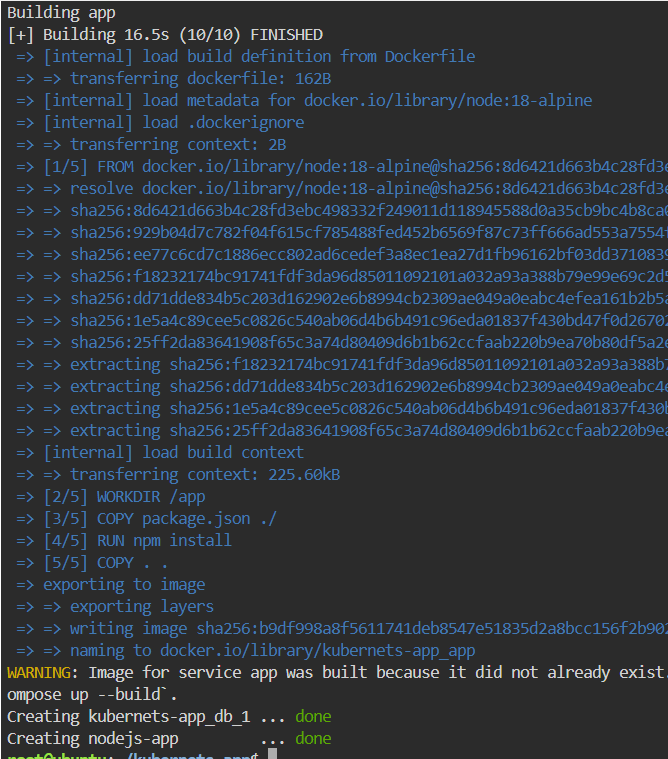
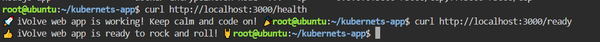

# Containerized Node.js and MySQL Stack Using Docker Compose

This repository contains a containerized Node.js web application connected to a MySQL database backend, configured and managed using Docker Compose.

---

## step 1: Clone the Repository
Clone the application source code and navigate into the project directory:


## step 2: Configure Environment Variables (.env)
To ensure sensitive data (like database credentials) are kept secure and decoupled from the infrastructure setup,
- create a `.env` file in the project's root directory 
- Add the environment variables inside the .env file:
  


## step 3: Configure Docker Compose
Create a `docker-compose.yml` file in the root directory. Docker Compose will automatically read the variables from the `.env` file created in the previous step:



## step 4: Build and Run the Stack
Start the services in detached mode using Docker Compose:



To verify that both containers are successfully running, use:
```bash
docker-compose ps
```


## step 5: Check Health and Readiness Endpoints
Test the application's health status and readiness checks:



