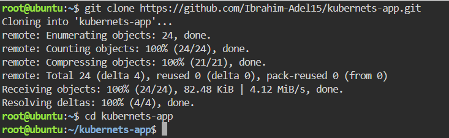
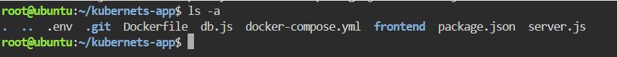

# Containerized Node.js and MySQL Stack Using Docker Compose

This repository contains a containerized Node.js web application connected to a MySQL database backend, configured and managed using Docker Compose.

---

## step 1: Clone the Repository
Clone the application source code and navigate into the project directory:

## step 2: Configure Docker Compose
Create a docker-compose.yml file to define the multi-container setup containing the Node.js application service (app) and the MySQL database service (mysql-db).

