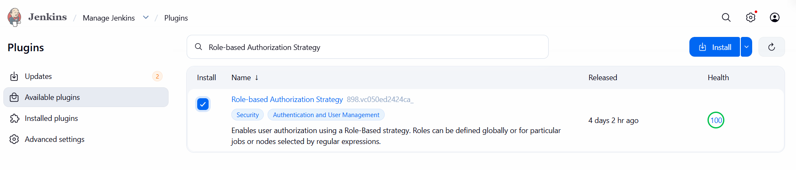
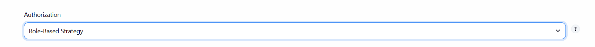
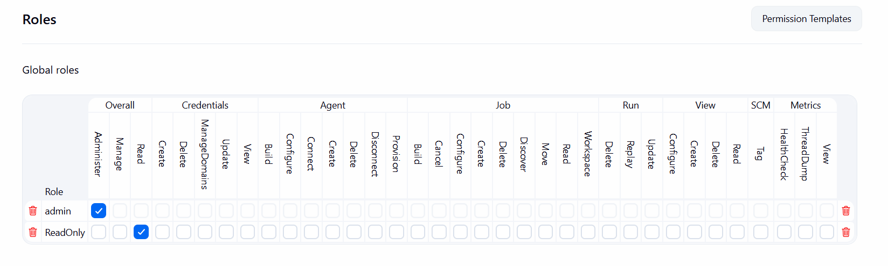
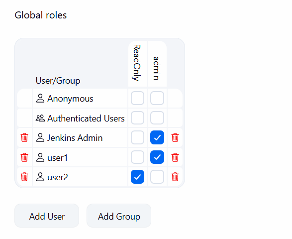

# Role-Based Authorization in Jenkins

This lab demonstrates how to secure Jenkins using the Role-based Authorization Strategy plugin. Two users are created with different roles: an administrator with full access and a read-only user with limited permissions.

---
## Step 1: Install the Role-based Authorization Strategy Plugin

## Step 2: Create Jenkins Users

Create the following users:

- user1
- user2

## Step 3: Enable Role-Based Authorization
Authorization: Role-Based Strategy

## Step 4: Create Roles

- **admin:** Grant all available permissions.
- **ReadOnly:** Grant the overall Read permissions.

 

 ## Step 5: Assign Roles to the Users
   Assign admin role for user1 & read-only role for user2

  

  

