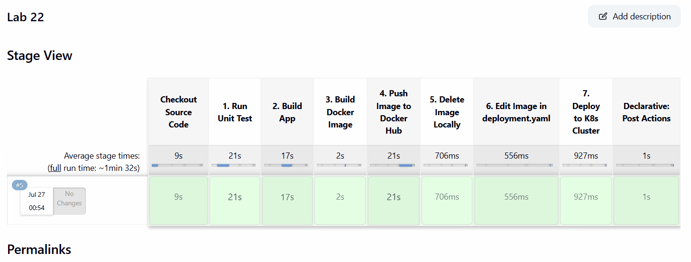

# Jenkins Pipeline for Application Deployment
This lab demonstrates an automated CI/CD pipeline using **Jenkins**, **Docker**, and **Kubernetes**. The pipeline clones the application repository, executes unit tests, builds the application, packages it into a Docker image, pushes the image to Docker Hub, updates the deployment manifest with the dynamic build tag, and deploys the updated workload to a Kubernetes cluster.

---

## Step 1: Clone the Repository
Clone the application source code and Dockerfile to inspect the project structure.

```bash
git clone https://github.com/ahmeddhussain/ivolve-jenkins-1.git
cd ivolve-jenkins-1
```
## Step 2: Create a file named `Jenkinsfile` at the root of your GitHub repository and paste the following code:
```bash
pipeline {
    agent any
    tools {
        maven 'Maven3'
    }
    environment {

        DOCKERHUB_CREDS = credentials('Dockerhub')
        IMAGE_NAME      = 'khairyops/jenkins-app'
        IMAGE_TAG       = "${BUILD_NUMBER}"
        FULL_IMAGE      = "${IMAGE_NAME}:${IMAGE_TAG}"
    }

    stages {
        stage('Checkout Source Code') {
            steps {
                echo 'Cloning source code from GitHub...'
                git branch: 'main', url: 'https://github.com/Ibrahim-Adel15/Jenkins_App.git'
            }
        }

        stage('1. Run Unit Test') {
            steps {
                container('maven') {
                    echo 'Running Maven Unit Tests...'
                    sh 'mvn test || true'
                }
            }
        }

        stage('2. Build App') {
            steps {
                container('maven') {
                    echo 'Building Jar Package using Maven...'
                    sh 'mvn clean package -DskipTests'
                    sh 'chmod -R 777 target || true'
                }
            }
        }

        stage('3. Build Docker Image') {
            steps {
                container('docker') {
                    echo "Building Docker image: ${FULL_IMAGE}"
                    sh "docker build -t ${FULL_IMAGE} ."
                }
            }
        }

        stage('4. Push Image to Docker Hub') {
            steps {
                container('docker') {
                    echo "Pushing image ${FULL_IMAGE} to Docker Hub..."
                    sh '''
                        echo "$DOCKERHUB_CREDS_PSW" | docker login -u "$DOCKERHUB_CREDS_USR" --password-stdin
                        docker push ${FULL_IMAGE}
                    '''
                }
            }
        }

        stage('5. Delete Image Locally') {
            steps {
                container('docker') {
                    echo "Deleting local image: ${FULL_IMAGE}..."
                    sh "docker rmi ${FULL_IMAGE} || true"
                }
            }
        }

        stage('6. Edit Image in deployment.yaml') {
          stage('Update deployment.yaml') {
            steps {
                sh "sed -i 's|image:.*|image: ${IMAGE_NAME}:${IMAGE_TAG}|' deployment.yaml"
            }
        }

        stage('7. Deploy to K8s Cluster') {
            steps {
                container('kubectl') {
                    echo 'Deploying application to Kubernetes cluster...'
                    sh 'kubectl apply -f deployment.yaml'
                }
            }
        }
    }

    post {
        always {
            echo 'Cleaning workspace and logging out...'
            container('docker') {
                sh 'docker logout || true'
            }
            container('maven') {
                sh 'rm -rf * || true'
            }
            deleteDir()
        }
        success {
            echo 'SUCCESS: App built, pushed, and deployed to Kubernetes successfully!'
        }
        failure {
            echo 'FAILURE: Check logs above for details.'
        }
    }
}
```

## Step 3: Add Required Credentials in Jenkins
Go to Jenkins Dashboard > Manage Jenkins > Credentials.

Add Docker Hub credentials (Username with password) with ID: docker-hub-credentials.

Add Kubeconfig configuration with ID: kubeconfig-credentials.

## Step 3: Create Jenkins Pipeline Job
In Jenkins Dashboard, click New Item.

Enter Lab22-Jenkins-Pipeline as the item name, select Pipeline, and click OK.

Under the Pipeline configuration section:

Definition: Pipeline script from SCM

SCM: Git

## Step 4: Run and Validate Pipeline
Click Build Now to trigger the build. Monitor the Stage View to verify all  steps execute successfully.



