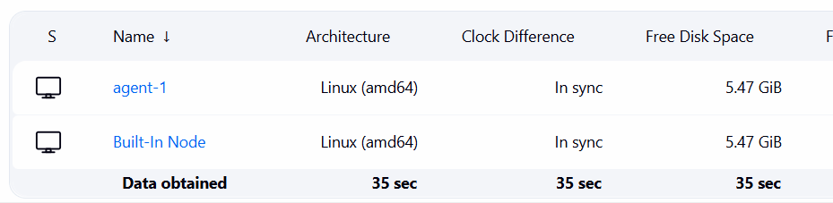
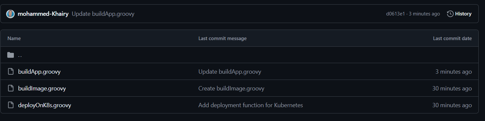
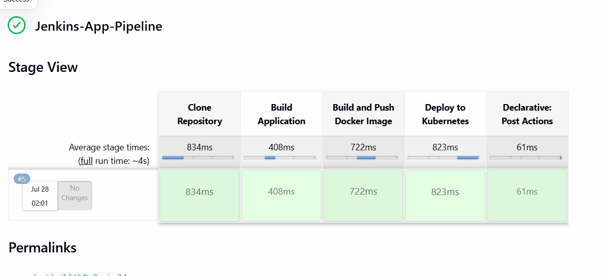

# CI/CD Pipeline Implementation with Jenkins Agents and Shared Libraries
This repository demonstrates a complete CI/CD pipeline implementation using Jenkins, Inbound Agents (Slaves), and Jenkins Shared Libraries to build and deploy an application on Kubernetes.
---

## Step 1: Configure Jenkins Inbound Agent (Slave)
- Add Node in Jenkins UI
- Start the Agent Process:
 



## Step 2: Set Up Jenkins Shared Library
Create Shared Library Repository Structure:
Create a GitHub repository named jenkins-shared-library
Define Library Functions (vars/)



- vars/buildApp.groovy
 ```bash
  
  def call() {
    stage('BuildApp') {
        sh 'mvn test'
        sh 'mvn clean package -DskipTests'
        sh 'ls -la target/*.jar'
    }
```
- vars/buildImage.groovy
```bash
def call(Map config) {
    def imageName = config.imageName
    def imageTag  = config.imageTag
    def credsId   = config.credsId ?: 'dockerhub-creds'   

    stage('BuildImage') {
        withCredentials([usernamePassword(
            credentialsId: credsId,
            usernameVariable: 'DOCKER_USER',
            passwordVariable: 'DOCKER_PASS'
        )]) {
            sh """
                docker build -t ${imageName}:${imageTag} .
                echo \$DOCKER_PASS | docker login -u \$DOCKER_USER --password-stdin
                docker push ${imageName}:${imageTag}
                docker rmi ${imageName}:${imageTag}
                docker logout
            """
        }
    }
}
```
- vars/deployOnK8s.groovy
```bash
def call(Map config) {
    def imageName  = config.imageName
    def imageTag   = config.imageTag
    def namespace  = config.namespace
    def apiServer  = config.apiServer
    def credsId    = config.credsId ?: 'jenkins-sa-token'

    stage('DeployOnK8s') {
        sh "sed -i 's|image:.*|image: ${imageName}:${imageTag}|' deployment.yaml"

        withCredentials([file(credentialsId: credsId, variable: 'SA_TOKEN_FILE')]) {
            sh """
                kubectl apply -f deployment.yaml \\
                  --server=${apiServer} \\
                  --insecure-skip-tls-verify=true \\
                  --token=\$(cat \$SA_TOKEN_FILE) \\
                  -n ${namespace}
            """
        }
    }
}
```
## Step 3:Register Global Library in Jenkins
- Default version: main
- Retrieval method: Modern SCM
- Source Code Management: Git
- Project Repository URL: `https://github.com/mohammed-Khairy/jenkins-shared-library.git`
- Save
  
## Step 4: Create and Execute the Jenkins Pipeline
Create a new Pipeline item named Jenkins-App-Pipeline and Configure the Jenkins file script :

```bash
@Library('my-shared-library') _

pipeline {
    agent { 
        label 'agent-1' 
    }

    parameters {
        string(name: 'DOCKER_USER',     defaultValue: 'khairyops',                                  
        string(name: 'APP_NAME',        defaultValue: 'jenkins-app',                                 
        string(name: 'IMAGE_TAG',       defaultValue: "${BUILD_NUMBER}",                      
        string(name: 'NAMESPACE',       defaultValue: 'default',                                
        string(name: 'GIT_REPO_URL',    defaultValue: 'https://github.com/Ibrahim-Adel15/Jenkins_App.git'
        string(name: 'GIT_BRANCH',      defaultValue: 'main',                                 
        string(name: 'DOCKER_CREDS_ID', defaultValue: 'dockerhub-creds',                     
        string(name: 'K8S_CREDS_ID',    defaultValue: 'jenkins-sa-token',                      
    }

    environment {
        FULL_IMAGE_NAME = "${params.DOCKER_USER}/${params.APP_NAME}"
        IMAGE_TAG       = "${params.IMAGE_TAG}"
        NAMESPACE       = "${params.NAMESPACE}"
        API_SERVER      = env.KUBERNETES_SERVICE_HOST ? "https://${env.KUBERNETES_SERVICE_HOST}:${env.KUBERNETES_SERVICE_PORT}" : "https://kubernetes.default.svc"
    }

    stages {
        stage('Checkout') {
            steps {
                git branch: params.GIT_BRANCH, url: params.GIT_REPO_URL
            }
        }

        stage('Build App') {
            steps {
                buildApp()
            }
        }

        stage('Build & Push Image') {
            steps {
                buildImage(
                    imageName: "${env.FULL_IMAGE_NAME}",
                    imageTag:  "${env.IMAGE_TAG}",
                    credsId:   params.DOCKER_CREDS_ID
                )
            }
        }

        stage('Deploy to Kubernetes') {
            steps {
                deployOnK8s(
                    imageName: "${env.FULL_IMAGE_NAME}",
                    imageTag:  "${env.IMAGE_TAG}",
                    namespace: "${env.NAMESPACE}",
                    apiServer: "${env.API_SERVER}",
                    credsId:   params.K8S_CREDS_ID
                )
            }
        }
    }

      post {
        always {
            echo 'Pipeline finished.'
        }
        success {
            echo 'Deployment completed successfully.'
        }
        failure {
            echo 'Pipeline failed.'
        }
    }
}
```

