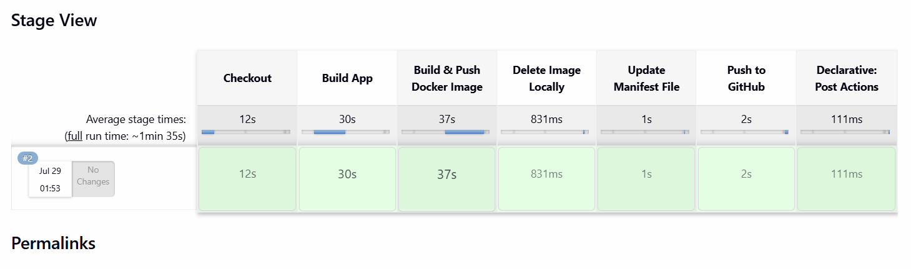
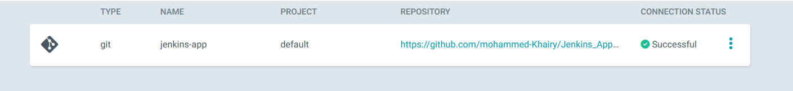
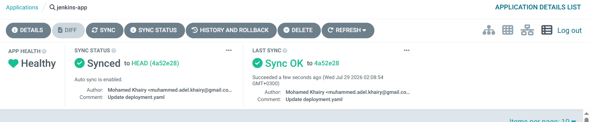

# GitOps workflow CI/CD Pipeline (Jenkins + ArgoCD)

Automated **GitOps Continuous Integration & Continuous Delivery (CI/CD)** pipeline using **Jenkins** for building and pushing artifacts, and **ArgoCD** for continuous deployment to a **Kubernetes Cluster**.

---

## Step 1: Jenkins CI Automation Pipeline

The pipeline runs inside a Kubernetes dynamic agent pod, performing testing, artifact generation, containerization, and GitOps manifest updates.

#### Pipeline Stage View Summary:
* **Checkout**: Fetches source code from GitHub.
* **Build App**: Compiles and packages the app using Maven (`mvn clean package`).
* **Build & Push Docker Image**: Builds the container image and pushes it to Docker Hub under `khairyops/jenkins-app:v<BUILD_NUMBER>`.
* **Delete Image Locally**: Cleans up unused local images on the builder node.
* **Update Manifest File**: Updates `deployment.yaml` with the latest image version via `sed`.
* **Push to GitHub**: Commits and pushes the updated manifest file directly back to the GitHub repo.
  

## Step 2: ArgoCD Repository Connection Setup

Before deploying applications, ArgoCD establishes a secure, validated connection to the target Git Repository.

#### Repository Details:
* **Type**: `Git`
* **Name**: `jenkins-app`
* **Project**: `default`
* **Repository URL**: `https://github.com/mohammed-Khairy/Jenkins_App.git`
* **Connection Status**: `Successful`

## Step 3: GitOps Deployment Verification & Cluster Health

Once Jenkins updates the `deployment.yaml` in the Git repository, ArgoCD automatically triggers a synchronization cycle to reflect the changes inside the Kubernetes cluster.

