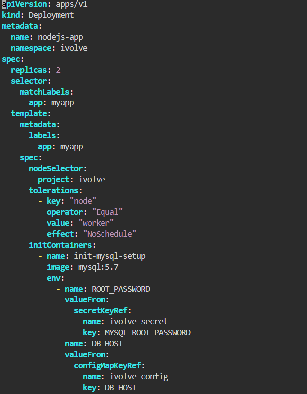
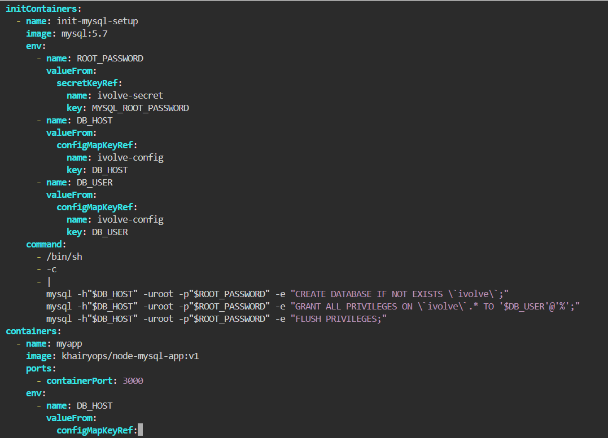
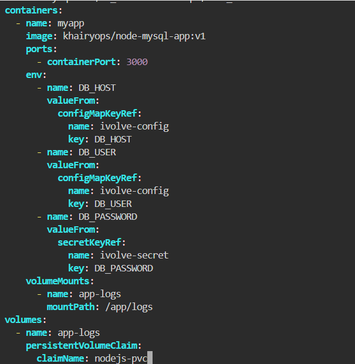
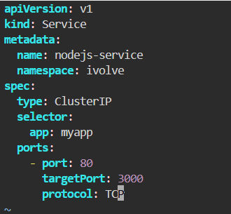
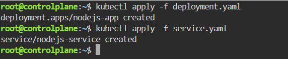
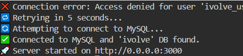

#  Node.js Application Deployment with ClusterIP service
This guide walks through deploying a Node.js application alongside a MySQL database in a multi-node Kubernetes cluster. It includes configuring persistence (PV/PVC), environment configuration (ConfigMap & Secrets), node scheduling constraints (Tolerations & NodeSelectors), database initialization via Init Containers, and internal routing using a ClusterIP Service.

---

## Step 1: Deploy Node.js App with Init Container
Create a file named `deployment.yaml`. The Init Container connects to MySQL prior to app startup to automatically create the ivolve database and set user permissions:

### Init Container runs using a MySQL client image. It reads database connection parameters from the ConfigMap and Secret to execute SQL commands that:

- Ensure the ivolve database exists.

- Create the application user (ivolve_user).

- Grant full privileges to ivolve_user on the ivolve database.
 

## Step 2: Create ClusterIP Service
Create a file named `service.yaml` to route traffic to the application replicas:

## Step 3: Apply the configuration files

Apply the deployment and service manifests:

## Step 4: Verify Application Logs and Service Connectivity

