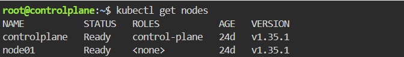
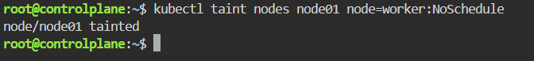
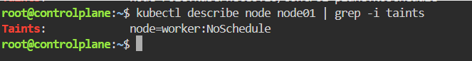

# Node Isolation Using Taints in Kubernetes
This repository/guide provides a step-by-step walkthrough to perform **Node Isolation Using Taints** .

---

# Step 1: Run Kubernetes cluster with 2 nodes
How to run it locally (using Minikube):
If we were setting up this lab on a local machine, we would spin up a 2-node Kubernetes cluster using the following Minikube command:
```bash
minikube start --nodes 2
```
Bypassing this step on the Killercoda Playground:
Since we are utilizing the Killercoda Playground for this lab, we will bypass this manual provisioning step. The playground environment automatically spins up and configures a 2-node cluster for us upon startup.

Verification:
To verify that the pre-provisioned 2-node cluster is active and healthy in the playground, run:
```bash
kubectl get nodes
```


## Step 2: Apply Taint to the Worker Node
To prevent pods from being scheduled on the worker node unless they specifically tolerate it, we apply a Taint.



## step 3: Describe Nodes to Verify the Taint
Verify that the taint has been successfully attached to the node metadata by describing the node. 


