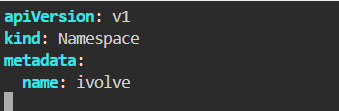
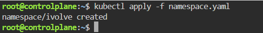
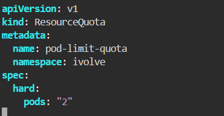
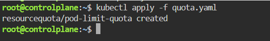
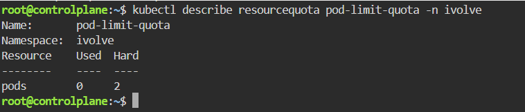
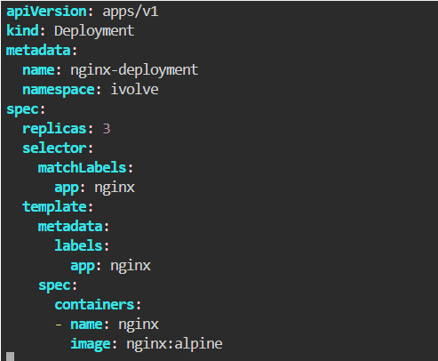
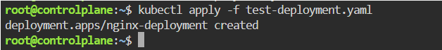
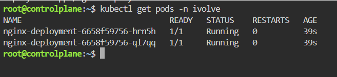
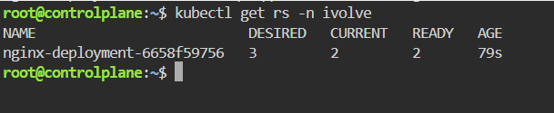
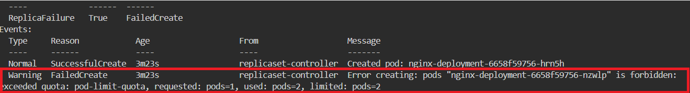

# Namespace Management and Resource Quota Enforcement
This repository/guide provides a step-by-step walkthrough to perform Namespace Management and Resource Quota Enforcement in Kubernetes.

---

## Step 1: Create the Namespace `(namespace.yaml)`
The Namespace acts as an isolated virtual workspace where we will run our resources.

- create a new file named `namespace.yaml` with the following configuration into the file:



- Apply the file to create the namespace:



## Step 2: Enforce Pod Limits Using Resource Quota (quota.yaml)
Now, we will define a Resource Quota for our namespace ivolve to restrict the maximum number of pods to exactly 2.

-  Create a new file named `quota.yaml` with the following configuration into the file:

 

- Apply the quota file:

 

## Step 3: Describe the Resource Quota to Verify the Constraint
Let's verify that the quota has been successfully attached to our namespace.

 

## Step 4: Practical Test (The Verification)
To prove beyond doubt that the Resource Quota is working, we will try to deploy 3 Pods to see if Kubernetes blocks the third one. The best declarative way to test this is by deploying a Deployment configured with replicas: 3.

- Create a new file named `test-deployment.yaml` with the following configuration (using a lightweight Alpine-based Nginx image):
  
   
   
- Apply the deployment:
  
   

- List the running pods in the namespace:

   
   <br>
   


### Result: You will find exactly 2 Pods Running.

To locate the third pod and discover why it was blocked, let's inspect the ReplicaSet created by our Deployment:

Describe the ReplicaSet to view the rejection events sent by the Kubernetes API server:
```bash
kubectl describe replicaset <your-replicaset-name> -n ivolve
```
   
