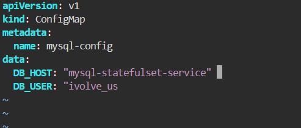
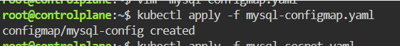
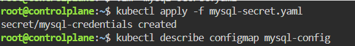
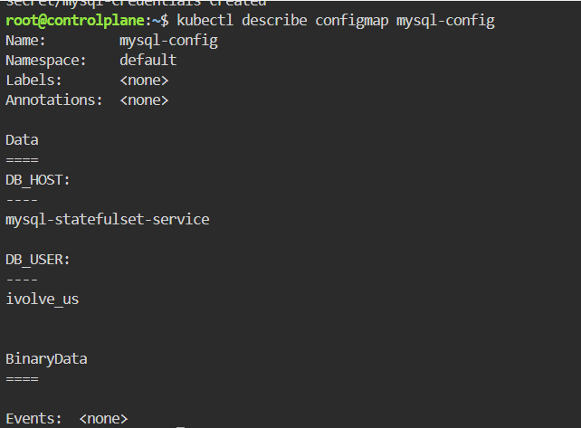
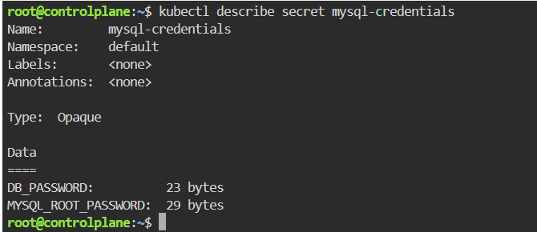

# Managing Configuration and Sensitive Data with ConfigMaps and Secrets
This repository contains the Kubernetes manifests and step-by-step instructions to securely manage configuration variables and sensitive data for a MySQL database using **ConfigMaps** and **Secrets**.

---

## Step 1: Base64 Encode Sensitive Data
Kubernetes Secrets require data to be base64 encoded. Run the following commands in your terminal to encode your database user password and MySQL root password:

```bash
# Encode DB_PASSWORD (e.g., "my_secure_user_pass")
echo -n 'my_secure_user_pass' | base64

# Encode MYSQL_ROOT_PASSWORD (e.g., "my_secure_root_pass")
echo -n 'my_secure_root_pass' | base64
```

## Step 2: Create the Secret Manifest
Create a file named `secret.yaml` to store your encoded sensitive MySQL credentials.

```bash
apiVersion: v1
kind: Secret
metadata:
  name: mysql-credentials
  namespace: default
type: Opaque
data:
  DB_PASSWORD: bXlfc2VjdXJlX3VzZXJfcGFzcw=
  MYSQL_ROOT_PASSWORD: bXlfc2VjdXJlX3Jvb3RfcGFzcw=
```


## Step 3: Create the ConfigMap Manifest
Create a file named `configmap.yaml` to store non-sensitive configuration parameters.



## Step 4: Apply the Manifests to the Cluster
Deploy both resources to your Kubernetes cluster using kubectl apply:




## Step 5: Verify the Created Resources
Verify that the ConfigMap and Secret have been successfully created and contain the correct metadata.





