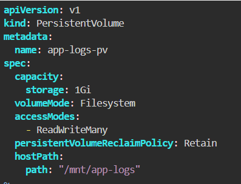
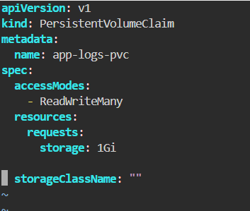
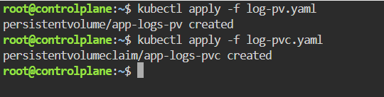
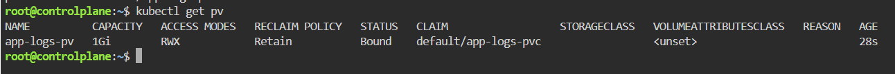
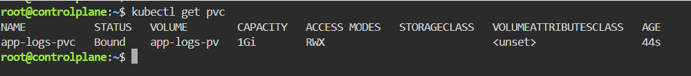

# Persistent Storage Setup for Application Logging

This repository contains the Kubernetes manifests and step-by-step instructions to set up persistent storage using a **Persistent Volume (PV)** and a **Persistent Volume Claim (PVC)** for application logging.

---

## Step 1: Define the Persistent Volume (PV) Manifest
Create a file named `log-pv.yaml` to define a Persistent Volume. This volume allocates `1Gi` of storage using a `hostPath` on the host system at `/mnt/app-logs` with a `Retain` reclaim policy.

## Step 2: Define the Persistent Volume Claim (PVC) Manifest
Create a file named log-pvc.yaml to define a Persistent Volume Claim that requests 1Gi of storage with an access mode matching the PV (ReadWriteMany).

## Step 3: Apply the Manifests to the Cluster
Deploy both resources to your Kubernetes cluster using kubectl apply:

## Step 4: Verify the Persistent Volume (PV)
Check the status of the created Persistent Volume. It should show a status of Bound and be linked to your PVC.

## Step 5: Verify the Persistent Volume Claim (PVC)
Confirm that the Persistent Volume Claim has successfully bound to the volume.

