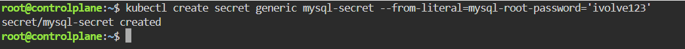

#  StatefulSet with Headless Service
This guide provides a step-by-step walkthrough to deploy a StatefulSet with a Headless Service running MySQL on Kubernetes.

---

##Step 1: Create the Database Secret
We secure the MySQL root password by creating a Kubernetes Secret resource.

