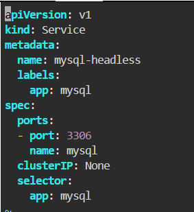
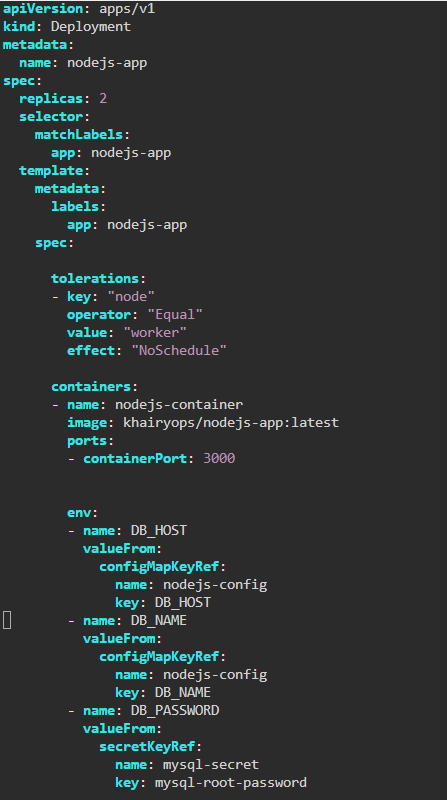
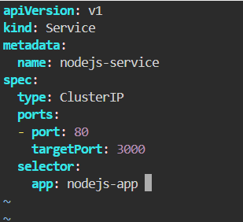
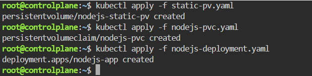
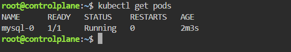
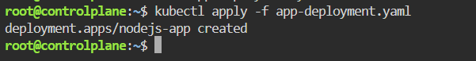
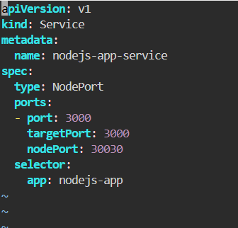
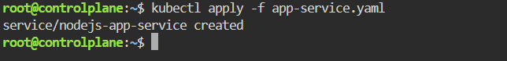
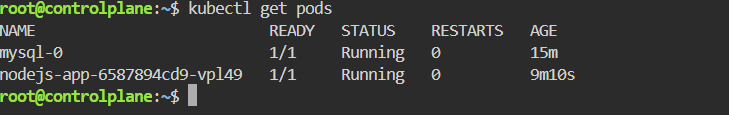
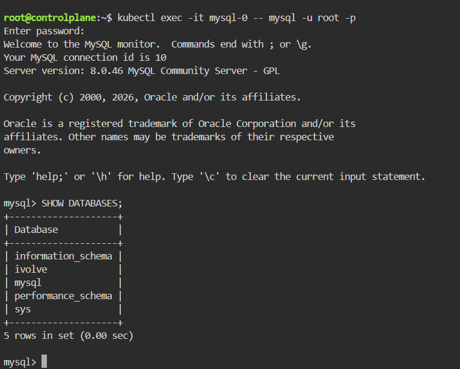

#  StatefulSet with Headless Service
This guide provides a step-by-step walkthrough to deploy a StatefulSet with a Headless Service running MySQL on Kubernetes.

---

## Step 1: Create the Database Secret
We secure the MySQL root password by creating a Kubernetes Secret resource.

## Step 2: Configure MySQL Headless Service
To establish fixed network identities for our StatefulSet pods, we create a Headless Service.

Create a file named `mysql-service.yaml`.

Apply the service configuration:

## Step 3: Deploy MySQL Using a StatefulSet
We deploy a stable, stateful instance of MySQL that leverages data persistence and mounts our secret credentials.

Create a file named `mysql-statefulset.yaml`

Apply the StatefulSet:

## Step 4: Deploy the Node.js Web Application
We deploy our custom frontend/backend container application and link it to the MySQL database backend.

Create a file named `app-deployment.yaml`.

Apply the deployment manifest:

## Step 5: Expose the Web Application (NodePort Service)
To access the running application outside the cluster via port 30030, we deploy a standard NodePort service.

Create a file named `app-service.yaml`.

Apply the application service configuration:

## Step 6: Verification and Status Checks
To ensure that both the backend database and frontend web services are fully operational, execute the status command below:

