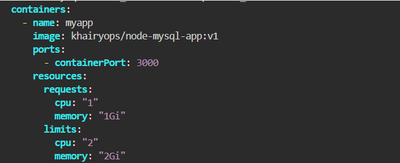
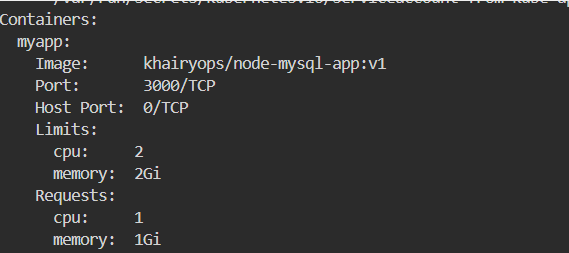

# Pod Resource Management (Requests & Limits)
This lab focuses on implementing Resource Management for the Node.js application by defining CPU and Memory Requests and Limits in the Deployment specification, followed by status verification.
---
## Step 1: Update Deployment Manifest
Update the existing deployment.yaml file to include the resources section under the application container spec:



## Step 2: Apply the Updated Deployment
Apply the updated configuration to the cluster:

```bash
kubectl apply -f deployment.yaml -n ivolve
```
## Step 3: Verify Resource Allocation via (kubectl describe)
Inspect one of the newly created Pods to confirm that Kubernetes registered the CPU and Memory limits/requests correctly:



- We can monitor live CPU and Memory consumption across Pods in the namespace using 
```kubectl top pod -n ivolve``` but it requires the Metrics Server to be deployed and active in the cluster.
