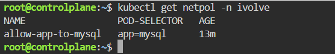
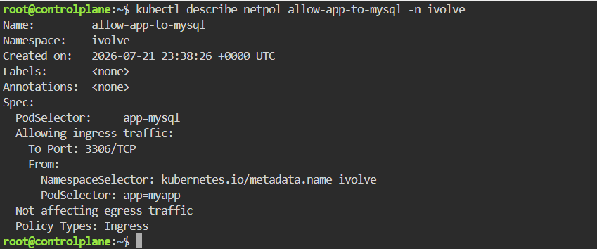

# Control Pod-to-Pod Traffic via Network Policy
This lab focuses on securing internal cluster communication by implementing a Kubernetes NetworkPolicy. The policy restricts ingress traffic to the MySQL database pod, allowing connections only from the Node.js application pods within the ivolve namespace on port 3306.

---

## Step 1: Create the network-policy.yaml File
Create a new file named network-policy.yaml with the following specification:


## Step 2: Apply the NetworkPolicy
Apply the policy to the ivolve namespac

```bash
kubectl apply -f network-policy.yaml -n ivolve
```

## Step 3: Verify Policy Deployment
List all active network policies in the ivolve namespace:



## Step 4: Describe NetworkPolicy Details
Inspect the detailed rules applied by the policy to confirm that ingress restrictions are properly set up:


