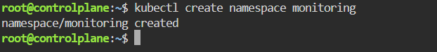
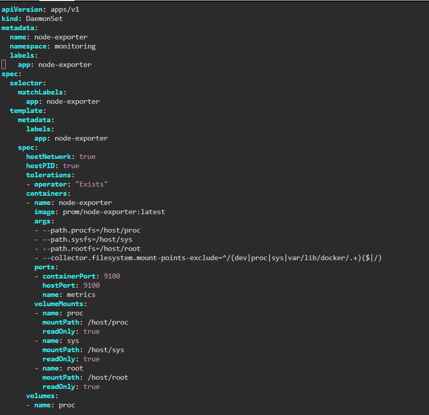
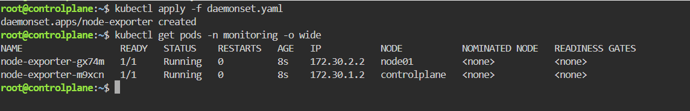
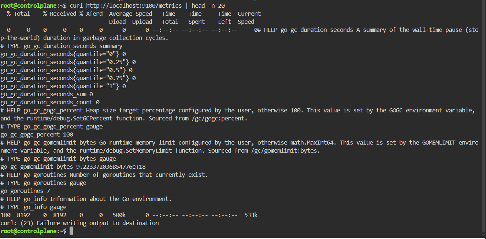

# Node-Wide Pod Management with DaemonSet
Production-grade deployment guide for Prometheus Node-Exporter on a Kubernetes cluster using DaemonSet, host-level filesystem mounting, host network binding, and wildcard taints tolerance.

---
## Step 1: Create the Monitoring Namespace
Isolate all monitoring workloads within a dedicated namespace:



## Step 2: Create the DaemonSet Manifest (daemonset.yaml)
Create a file named `daemonset.yaml` with following specs:



## Step 3: Deploy the DaemonSet
Apply the manifest file to the cluster:

```bash
kubectl apply -f daemonset.yaml
```

## Step 4: Verify Pod Scheduling across Nodes
Ensure that a node-exporter pod is scheduled and running on every node in the cluster (including controlplane) and Test host-level metrics retrieval over port 9100:



