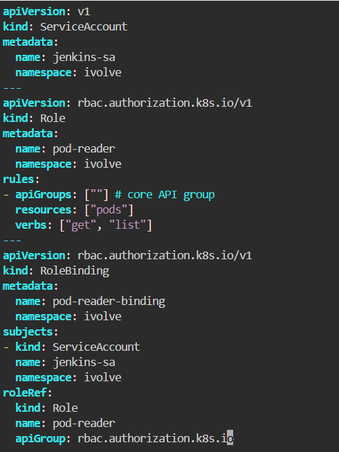
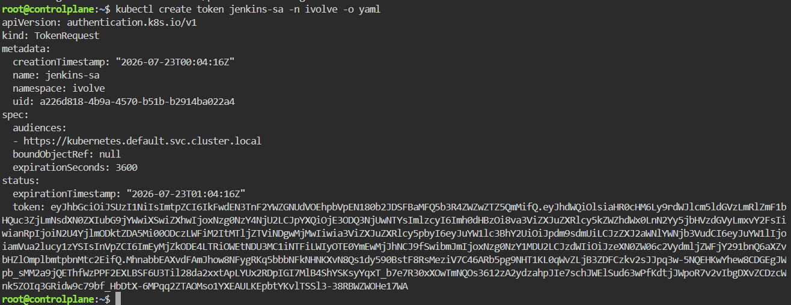
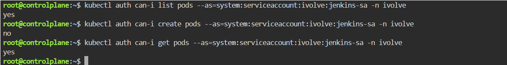

# Securing Kubernetes with RBAC and Service Accounts
This repository is a step-by-step practical guide for configuring Role-Based Access Control (RBAC) and Service Accounts in Kubernetes. In this lab, we will create a dedicated Service Account named `jenkins-sa` within the `ivolve` namespace, generate an authentication token, define a Role named `pod-reader` granting read-only permissions (`get`, `list`) exclusively for Pods, bind the Role to the Service Account using a `RoleBinding`, and finally validate that the Service Account is restricted to only listing Pods without any unauthorized access.

---
## Step 1: Create the Manifest File (rbac-lab.yaml)
Create a unified declarative manifest containing all RBAC objects

## Step 2: Apply Configuration & Generate SA Token
Apply the declarative configuration file to create all resources at once, then generate an authentication token for jenkins-sa.

> _Note: You can customize the token's lifetime using the `--duration flag`. Accepted time units include s (seconds), m (minutes), or h (hours).
> If no duration flag is specified, Kubernetes defaults to 1 hour (1h)._

## Step 4: Validation & Verification
Validate that the jenkins-sa Service Account has read-only access to Pods and is restricted from performing unauthorized actions.

